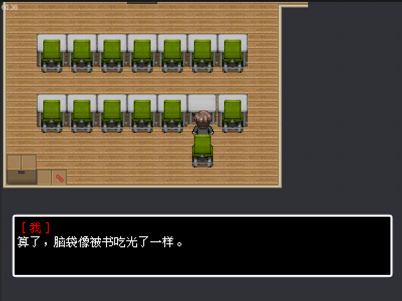
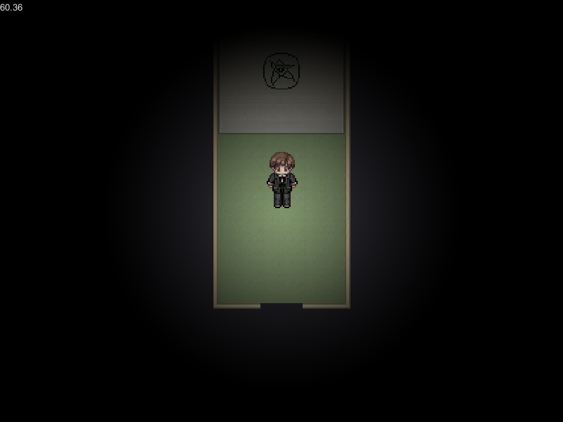
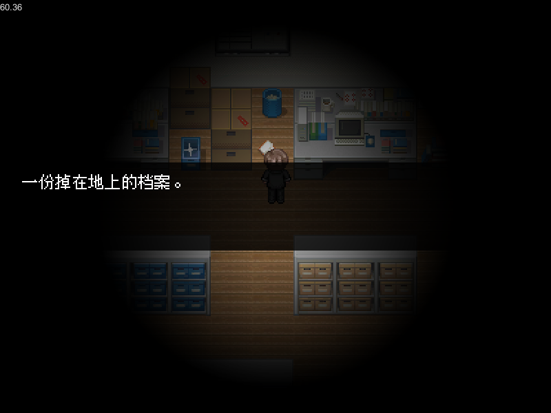
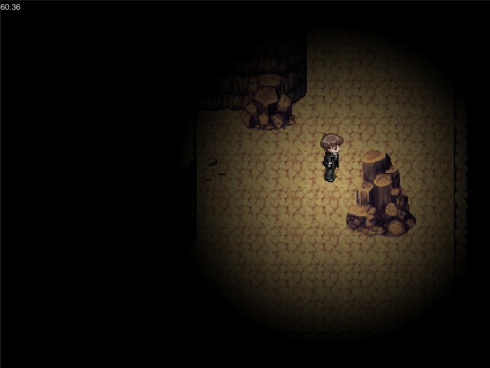

# 概览

> Hear me! King of Infinite Space! Planetmover! The Foundation of Fastness! Ruler of Earthquakes! The Vanquisher of Terror! The Creator of Panic! Destroyer! The Shining Victor! Son of Chaos and the Void! The Guardian of the Abyss! God of the Outermost Darkness! Lord of Dimensions! Riddle-knower! Guardian of The Secrets! Lord of the Labyrinth! Master of the Angles! God of the Whiporwills! Omegapoint! Lord of the Gate! Opener of the Way! The Oldest! All-in-One! The One by Life Prolonged! Umr At-Tawil! Iak-Sathath! Yog Sothoth NAFL'FTHAGN!!! Your servant call upon you!

Unity3D 引擎学习中，尝试制作一个简单的日式 RPG 恐解框架，无战斗系统。

# 剧情进度：

- 最终追逐战，效率优化中。

# 已完成的事件解释器功能：

- 显示文章
- 显示选择项
- 条件分歧
- 循环开始
- 中断循环
- 中断事件处理
- 公共事件
- 跳转标志
- 跳转
- 开关操作
- 变量操作
- 独立开关操作
- 增减物品
- 注释
- 场所移动
- 设置事件位置
- 设置移动路线
- 暂时消除事件
- 画面震动
- 等待
- 显示图片
- 移动图片
- 消除图片
- 更改画面色调
- 播放BGM
- 淡出BGM
- 播放SE
- 停止SE
- 开启/关闭展示地图名
- 脚本

# 环境

- Unity2017 4.8f1

# 游戏截图

<mark>点击查看详细内容</mark>

# 素材来源

- [ドット絵世界](http://yms.main.jp/dotartworld/index.html)

- [kauzz](https://kauzzresources.wordpress.com/)

- [Sithjester](http://untamed.wild-refuge.net/rmxpresources.php)

- [IceDragon/Enterbrain](http://forums.rpgmakerweb.com/index.php?/user/36-icedragon/)

- [Caitlin Nicnubill](http://nicnubill.deviantart.com/)

- [Rayane Félix](https://opengameart.org/content/rpg-terrains)

- [Gage Prentiss](http://www.hplhs.org/images/dart/hod/prentisstrap.jpg) ※ 如果有公共授权的 **偏方三八面体** 图片，请告诉我。
